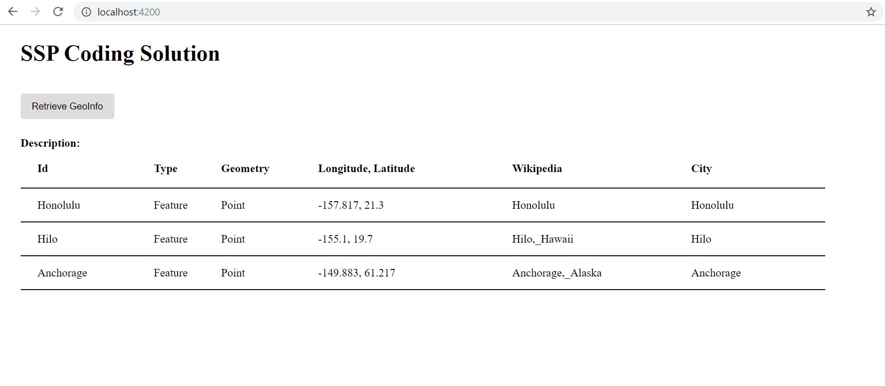

# SSPSolution

This project was generated with [Angular CLI](https://github.com/angular/angular-cli) version 6.2.9. 

Project was updated to use Angular 8.2.14. JSON data is displayed using an Angular Material table. To run project please clone repository and ensure that you have the angular cli install. Move to SSPSolution and type ng serve. Open browser and move to http://localhost:4200

Relevant code can be found at:

[sspgeoinfo.component.ts](src/app/sspgeoinfo/sspgeoinfo.component.ts)

## Development server

Run `ng serve` for a dev server. Navigate to `http://localhost:4200/`. The app will automatically reload if you change any of the source files.

## Build

Run `ng build` to build the project. The build artifacts will be stored in the `dist/` directory. Use the `--prod` flag for a production build.

## Further help

To get more help on the Angular CLI use `ng help` or go check out the [Angular CLI README](https://github.com/angular/angular-cli/blob/master/README.md).

